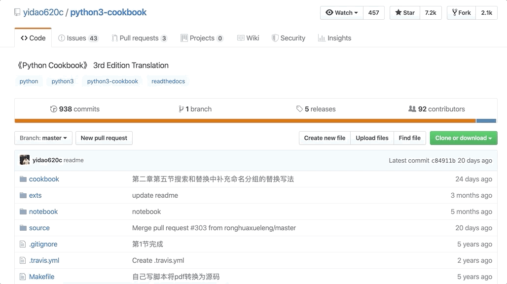

# How To Use The Site
### Loading The Code
A good platform for running the programs is Jupyter. Jupyter is an open- source software, that would both run various programming languages and show the results.

### Developing The Code
If there's a product you would like to further develop and play around, you can click on the "fork" button, which would allow you to duplicate the existing product into a version that can be edited.

### Expert
For experts who are interested in the developer code, click on the `View on GitHub button`, and you will be lead to the developer site.
 

