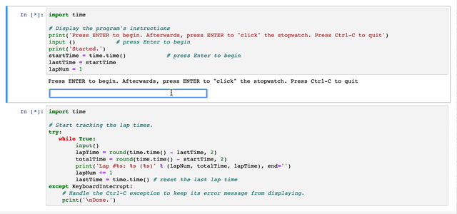

# Stopwatch

Hangman is a paper and pencil guessing game for two or more players. One player thinks of a word, phrase or sentence and the other tries to guess it by suggesting letters or numbers, within a certain number of guesses. 

> Coding Skills: Number, String, Tuple, Dictionary 

### How To Run The Program
For this program, you will need to copy 1 files. 
   1. <a href="https://github.com/Theresiap/Personal-Project/blob/master/Stopwatch/Stopwatch.md">Main Code</a>

When loading the main code, you will need two lines: 
   1. The first line is to start the stopwatch
   2. The second line is to stop the stopwatch and add more laps

To start/stop/add a lap, press `Enter` on your keyboard. 
The gif below shows how the code should look like.

#### Enjoy!
>  <a href="https://theresiap.github.io/Personal-Project/">Return To Main Page</a>
